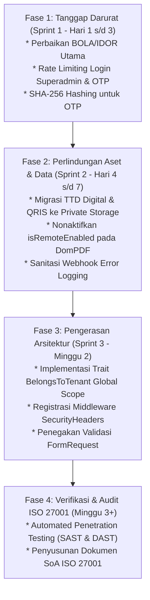

# Laporan Analisis Keamanan Sistem & Mitigasi Berstandar ISO 27001

**Aplikasi:** Web Pembukuan & Administrasi Terintegrasi (Laravel 12)  
**Tanggal Audit:** 03 Oktober 2026  
**Klasifikasi Dokumen:** Taraf Keamanan Terbatas (Confidential - Security Audit)  
**Standar Acuan:** ISO/IEC 27001:2022 (Information Security Management Systems) & OWASP Top 10

---

## 1. Overview

Sistem **Web Pembukuan** merupakan aplikasi berbasis Laravel 12 yang mengelola pencatatan keuangan akuntansi, kasir (POS), persediaan stok gudang (_warehouse management_), piutang/hutang (_sub-ledger debitur-kreditur_), serta administrasi korespondensi dan operasional perusahaan (surat masuk, surat keluar, notulen rapat, agenda perjalanan, faktur penjualan, surat pesanan, dan memo kredit).

Arsitektur sistem mengadopsi model **multi-tenant logical separation** dalam satu basis data bersama (_shared database_), di mana setiap tenant/perusahaan diidentifikasi menggunakan `user_id`. Dokumen ini menyajikan audit menyeluruh terhadap arsitektur kontrol akses, kerahasiaan data, integritas transaksi, mekanisme autentikasi, serta kepatuhan tata kelola keamanan berdasarkan klausul kontrol **ISO/IEC 27001:2022 Lampiran A**.

### Ringkasan Postur Keamanan

| Domain Evaluasi                          | Status Kepatuhan  | Tingkat Risiko        | Kontrol Utama ISO 27001 Terkait |
| :--------------------------------------- | :---------------- | :-------------------- | :------------------------------ |
| **Isolasi Multi-Tenant (BOLA/IDOR)**     | Non-Compliant     | **Kritis (Critical)** | A.5.15, A.8.2, A.8.3            |
| **Penyimpanan Dokumen & TTD Digital**    | Non-Compliant     | **Kritis (Critical)** | A.8.12, A.8.24                  |
| **Autentikasi & Brute Force Protection** | Partial Compliant | **Tinggi (High)**     | A.8.5                           |
| **Penyimpanan Kode Rahasia (OTP)**       | Non-Compliant     | **Tinggi (High)**     | A.8.24                          |
| **Kebocoran Telemetri / Error Logging**  | Non-Compliant     | **Sedang (Medium)**   | A.8.11, A.8.15                  |
| **Konfigurasi HTTP Headers & Cookie**    | Non-Compliant     | **Sedang (Medium)**   | A.8.20, A.8.26                  |
| **Validasi Input & Integritas Data**     | Partial Compliant | **Sedang (Medium)**   | A.8.28                          |

---

## 2. Critical Vulnerabilities

Berdasarkan audit statis kode sumber dan penelusuran alur eksekusi (_data flow analysis_), ditemukan celah-celah keamanan kritikal sebagai berikut:

---

### [CRIT-01] Kerentanan Sistemik Broken Object Level Authorization (BOLA / IDOR) Antar Tenant

- **Kategori OWASP:** A01:2021 – Broken Access Control
- **CWE ID:** CWE-639 (Authorization Bypass Through User-Controlled Key), CWE-284 (Improper Access Control)
- **Klausul ISO 27001:2022:** A.5.15 (Access control), A.**8**.3 (Information access restriction)
- **Dampak:** Pelanggaran kerahasiaan (_confidentiality_) dan integritas (_integrity_) menyeluruh. Tenant dapat membaca, memodifikasi, dan menghapus inventaris, data pelanggan, transaksi kasir, buku jurnal, serta dokumen legal perusahaan lain.

#### Temuan Kode:

Sejumlah besar _controller_ dan _service layer_ menginstansiasi model langsung menggunakan `find()`, `findOrFail()`, atau _route model binding_ tanpa menambahkan filter kepemilikan tenant (`where('user_id', auth()->id())`):

1. **`app/Http/Controllers/BarangController.php` (Barang & Kartu Gudang):**
    - Metode `show($id)`, `update($id)`, dan `destroy($id)` langsung menjalankan `Barang::find($id)`. Pengguna terautentikasi dapat menghapus atau mengubah harga beli/jual produk milik perusahaan lain.
    - Metode `createKartuGudang($barang_id)`, `storeKartuGudang(..., $barangId)`, dan `deleteKartuGudang($id)` memungkinkan manipulasi kartu stok gudang dan mutasi jurnal penyesuaian antar tenant.
2. **`app/Http/Controllers/KasirController.php` (Kasir & Jurnal Kas):**
    - Pada baris 232 (`destroy($id)`), kode menjalankan:
        ```php
        $log = KasirTransactionLog::findOrFail($id);
        $journalEntryId = $log->journal_entry_id;
        KartuGudang::where('journal_entry_id', $journalEntryId)->delete();
        $journalEntry = JournalEntry::find($journalEntryId);
        if ($journalEntry) { $journalEntry->delete(); }
        ```
        Penyerang dari tenant A dapat mengirimkan ID transaksi kasir tenant B untuk membatalkan transaksi dan merusak konsistensi jurnal keuangan serta stok fisik tenant B.
3. **`app/Http/Controllers/DebiturController.php` (Master Pelanggan / Debitur-Kreditur):**
    - Pada baris 36 (`destroy(Pelanggan $pelanggan)`), Laravel melakukan _implicit route model binding_ tanpa pengecekan kepemilikan (`$pelanggan->delete()`), memungkinkan tenant mana pun menghapus daftar rekanan bisnis perusahaan lain.
4. **`app/Services/AdministrasiFakturService.php` (Faktur Penjualan):**
    - Pada pembuatan faktur penjualan, parameter `spb_id` diterima dari request dan langsung diambil via `SuratPengirimanBarang::find($data['spb_id'])`. Tenant A dapat membuat faktur piutang yang menunjuk surat pengiriman barang (SPB) milik Tenant B.
5. **Modul Administrasi Korespondensi & Legalitas:**
    - **`SuratKeluarController.php`:** `destroy($id)` dan `downloadPdf($id)` menggunakan `AgendaSuratKeluar::findOrFail($id)` tanpa validasi `user_id`. Penghapusan ini juga menghapus lampiran surat dan tanda tangan di disk.
    - **`KasKecilController.php`:** `generatePdf($id)` memuat `KasKecil::findOrFail($id)` dan mengizinkan pengunduhan formulir klaim kas kecil perusahaan lain.
    - **`SuratUndanganRapatService.php`:** `update($id)` dan `generatePdf($id)` tidak memeriksa pemilik surat.
    - **`ManajemenRapatService.php`:** `destroy($id)`, `update($id)`, dan `generatePdf($id)` menjalankan `AgendaRapat::findOrFail($id)`.
    - **`AgendaJanjiTemuService.php`:** `delete($id)` dan `generatePdf($id)` tidak memverifikasi `user_id`.

---

### [CRIT-02] Paparan Publik Berkas Sensitif, Tanda Tangan Digital Pimpinan, dan Stempel Perusahaan

- **Kategori OWASP:** A01:2021 – Broken Access Control, A04:2021 – Insecure Design
- **CWE ID:** CWE-200 (Exposure of Sensitive Information), CWE-732 (Incorrect Permission Assignment for Critical Resource)
- **Klausul ISO 27001:2022:** A.8.12 (Data leakage prevention), A.8.24 (Use of cryptography), A.8.10 (Information deletion)
- **Dampak:** Aset digital legal berisiko tinggi (tanda tangan digital pimpinan, notulen rahasia, surat masuk, barcode QRIS) dapat diakses tanpa autentikasi oleh pihak publik melalui URL web statis, membuka peluang pemalsuan dokumen (_document forgery_).

#### Temuan Kode:

1. **`app/Services/FileUploadService.php`:**

    ```php
    $fileName = $slugName.'-'.time().'-'.Str::random(10).'.'.$file->getClientOriginalExtension();
    $path = $file->storeAs($folder.'/'.$email, $fileName, 'public');
    ```

    - Berkas disimpan pada disk `public` (`storage/app/public` yang disinkronisasi ke direktori publik web server `public/storage`).
    - Seluruh tanda tangan pimpinan (`ttd_pemimpin`, `ttd_pengirim`, `ttd_notulis`), lampiran surat keluar/masuk, dan QRIS dapat diunduh siapa saja tanpa login jika URL atau pola penamaannya diketahui.
    - Menggunakan `$file->getClientOriginalExtension()` (input dari sisi klien) alih-alih `$file->extension()` (berdasarkan deteksi MIME type di server).

---

### [CRIT-03] Kerentanan Brute Force pada Verifikasi OTP & Portal Login Superadmin

- **Kategori OWASP:** A07:2021 – Identification and Authentication Failures
- **CWE ID:** CWE-307 (Improper Restriction of Excessive Authentication Attempts)
- **Klausul ISO 27001:2022:** A.8.5 (Secure authentication)
- **Dampak:** Pembajakan akun pengguna melalui tebakan OTP otomatis, serta pengambilalihan hak akses superadmin melalui serangan kamus (_credential stuffing_).

#### Temuan Kode:

1. **`app/Http/Controllers/UserVerificationController.php` (`verify`):**
    - Endpoint verifikasi OTP 6 digit tidak dilindungi _rate limiting_ / _throttling_.
    - Dengan 900.000 kombinasi angka (100000 - 999999) dan masa kedaluwarsa OTP yang mencapai 30 menit (`addMinutes(30)`), penyerang terautentikasi dapat menjalankan skrip otomatis untuk menebak kode dalam hitungan detik.
2. **`account-verification/resend` (`regenerateOtp`):**
    - Tidak memiliki interval pembatas (_cooldown period_). Pengguna/bot dapat memicu ratusan pengiriman email per detik, membebani kuota SMTP (_denial of service_) atau _email bombing_.
3. **`app/Http/Controllers/Admin/RegisteredAdminController.php` (`store`):**
    - Route `POST /login/superadmin` tidak menerapkan middleware `throttle:6,1`. Percobaan login superadmin dapat diulang tanpa batas tanpa memicu penguncian akun.

---

### [CRIT-04] Penyimpanan Kode Rahasia Sementara (OTP) Secara Plaintext di Basis Data

- **Kategori OWASP:** A02:2021 – Cryptographic Failures
- **CWE ID:** CWE-312 (Cleartext Storage of Sensitive Information), CWE-256 (Unprotected Storage of Credentials)
- **Klausul ISO 27001:2022:** A.8.24 (Use of cryptography)
- **Dampak:** Setiap pihak dengan akses baca ke basis data (administrator, _backup operator_, atau penyerang via SQL Injection) dapat langsung melihat OTP aktif dan memverifikasi atau mereset akun secara instan.

#### Temuan Kode:

- Pada `app/Http/Controllers/UserVerificationController.php`:
    ```php
    $user->otp = $otp;
    $user->otp_expires_at = $expiresAt;
    $user->save();
    ```
    Nilai OTP disimpan dalam format teks polos (_raw plaintext_) pada kolom `users.otp`.

---

### [CRIT-05] Kebocoran Data Sensitif melalui Telemetri Error Eksternal (Exception Leaks via Webhook)

- **Kategori OWASP:** A09:2021 – Security Logging and Monitoring Failures, A04:2021 – Insecure Design
- **CWE ID:** CWE-209 (Generation of Error Message Containing Sensitive Information), CWE-359 (Exposure of Private Personal Information)
- **Klausul ISO 27001:2022:** A.8.11 (Data masking), A.8.12 (Data leakage prevention), A.5.23 (Information security for use of cloud services)
- **Dampak:** Parameter sensitif (kredensial, sandi, kunci token, rincian koneksi database, struktur query SQL) yang terekam dalam _stack trace_ dikirimkan ke pihak ketiga tanpa filter atau enkripsi khusus.

#### Temuan Kode:

- Pada `bootstrap/app.php` baris 26-35 dan `app/Jobs/SendErrorLogJob.php`:
    ```php
    Http::post(config('services.n8n.webhook'), [
        'app' => config('app.name'),
        'env' => app()->environment(),
        'user' => $this->userData,
        'message' => $this->message,
        'file' => $this->file,
        'line' => $this->line,
        'trace' => $this->trace,
    ]);
    ```
    Setiap _unhandled exception_ akan mengeksekusi pengiriman _trace_ lengkap ke webhook eksternal n8n. Dalam arsitektur Laravel/PDO, kegagalan query database sering kali menyertakan _connection string_, nama tabel, dan parameter data dalam teks _stack trace_.

---

### [CRIT-06] Risiko Server-Side Request Forgery (SSRF) pada Engine Generator PDF

- **Kategori OWASP:** A10:2021 – Server-Side Request Forgery (SSRF)
- **CWE ID:** CWE-918 (Server-Side Request Forgery)
- **Klausul ISO 27001:2022:** A.8.20 (Network security), A.8.28 (Secure coding)
- **Dampak:** Penyerang dapat memaksa server melakukan pemindaian jaringan internal (_internal port scanning_) atau meminta data dari _cloud instance metadata services_ (misal: `http://169.254.169.254/`).

#### Temuan Kode:

- Pada `app/Services/ManajemenRapatService.php` baris 370-372:
    ```php
    $pdf = Pdf::setOptions([
        'isRemoteEnabled' => true,
    ])->loadView(...);
    ```
    Opsi `isRemoteEnabled => true` pada library DomPDF mengizinkan rendering aset eksternal via HTTP/HTTPS/FILE. Jika data teks yang diisi pengguna (misal: deskripsi rapat atau URL gambar profil) mengandung tag `` ke jaringan lokal/intranet, server akan mengunduh payload tersebut.

---

### [CRIT-07] Ketiadaan HTTP Security Headers & Konfigurasi Cookie yang Belum Aman

- **Kategori OWASP:** A05:2021 – Security Misconfiguration
- **CWE ID:** CWE-16 (Configuration), CWE-1021 (Improper Restriction of Rendered UI Layers or Frames), CWE-614 (Sensitive Cookie in HTTPS Session Without 'Secure' Attribute)
- **Klausul ISO 27001:2022:** A.8.20 (Network security), A.8.26 (Application security requirements)
- **Dampak:** Rentan terhadap serangan _Clickjacking_, _MIME Sniffing_, dan pencurian sesi melalui koneksi yang tidak terenkripsi.

#### Temuan Kode:

1. `app/Http/Middleware/PreventBackHistory.php` hanya mengatur header `Cache-Control`, namun tidak mengonfigurasi:
    - `X-Frame-Options: SAMEORIGIN` atau `DENY`
    - `X-Content-Type-Options: nosniff`
    - `Strict-Transport-Security (HSTS)`
    - `Content-Security-Policy (CSP)`
    - `Referrer-Policy: strict-origin-when-cross-origin`
2. `config/session.php`:
    - `'secure' => env('SESSION_SECURE_COOKIE')`: Apabila variabel ini tidak diset aktif secara eksplisit di environment produksi, cookie sesi tidak membawa flag `Secure`, memungkinkan intersepsi saat transit.

---

## 3. Recommendations (Rekomendasi Sesuai ISO 27001)

Untuk memenuhi standar keamanan informasi internasional ISO/IEC 27001:2022, langkah-langkah mitigasi berikut harus diterapkan:

```
+-----------------------------------------------------------------------------------+
|                        KERANGKA MITIGASI ISO/IEC 27001:2022                       |
+-------------------+-------------------------------+-------------------------------+
| Klausul Kontrol   | Ruang Lingkup Masalah         | Tindakan Mitigasi Teknis      |
+-------------------+-------------------------------+-------------------------------+
| A.5.15 & A.8.3    | Multi-Tenant BOLA/IDOR        | Scope Tenant / Policy / Gate  |
| A.8.12 & A.8.24   | Tanda Tangan & QRIS Terbuka   | Private Storage & Signed URL  |
| A.8.5             | Brute-Force & OTP Flooding    | Rate Limiting & Lockout       |
| A.8.24            | OTP Plaintext di Database     | Cryptographic Hash (SHA-256)  |
| A.8.11 & A.8.15   | Kebocoran Stack Trace         | Sanitasi Log & Whitelist      |
| A.8.20 & A.8.28   | SSRF pada DomPDF              | Nonaktifkan isRemoteEnabled   |
| A.8.26            | Hardening Web Header & Cookie | SecurityHeaders Middleware    |
+-------------------+-------------------------------+-------------------------------+
```

### 3.1. Mitigasi BOLA/IDOR (ISO 27001: A.5.15, A.8.3)

1. **Penerapan Global Scope Kepemilikan Tenant:**
   Gunakan Trait `BelongsToTenant` atau _Global Scope_ pada seluruh model yang memiliki relasi `user_id`:

    ```php
    namespace App\Models\Concerns;

    use Illuminate\Database\Eloquent\Builder;

    trait BelongsToTenant
    {
        protected static function bootBelongsToTenant(): void
        {
            static::addGlobalScope('tenant', function (Builder $builder) {
                if (auth()->check()) {
                    $builder->where('user_id', auth()->id());
                }
            });

            static::creating(function ($model) {
                if (auth()->check() && ! $model->user_id) {
                    $model->user_id = auth()->id();
                }
            });
        }
    }
    ```

2. **Penerapan Route Model Binding Scoping:**
   Di `routes/web.php`, pastikan parameter model dibatasi ke user saat ini:
    ```php
    Route::delete('/{pelanggan}', [DebiturController::class, 'destroy'])
        ->can('delete', 'pelanggan');
    ```
3. **Penyempurnaan Controller IDOR:**
   Pastikan setiap query secara eksplisit memeriksa identitas pengguna:
    - Pada `BarangController`: ganti `Barang::find($id)` dengan `Barang::where('user_id', auth()->id())->findOrFail($id)`.
    - Pada `KasirController`: ganti `KasirTransactionLog::findOrFail($id)` dengan `KasirTransactionLog::where('user_id', auth()->id())->findOrFail($id)`.
    - Pada `SuratKeluarController`: ganti `AgendaSuratKeluar::findOrFail($id)` dengan `AgendaSuratKeluar::where('user_id', auth()->id())->findOrFail($id)`.

---

### 3.2. Mitigasi Penyimpanan Dokumen & Tanda Tangan (ISO 27001: A.8.12, A.8.24)

1. **Pindahkan Aset Legal ke Private Storage Disk:**
   Ubah default penyimpanan tanda tangan pimpinan, QRIS, dan surat ke disk `local` (`storage/app/private`):
    ```php
    // FileUploadService.php
    public function upload(UploadedFile $file, $folder = 'uploads', $email = 'user@email.com')
    {
        $extension = $file->extension(); // Gunakan ekstensi terverifikasi MIME
        $safeName = Str::uuid().'.'.$extension;
        return $file->storeAs('private/'.$folder.'/'.md5($email), $safeName, 'local');
    }
    ```
2. **Mekanisme Download Melalui Temporary Signed URL atau Controller Proxy:**
   Aset privat tidak boleh disajikan secara langsung oleh web server publik. Akses harus melewati controller yang memverifikasi kepemilikan sesi sebelum mengembalikan `response()->file()`:
    ```php
    public function viewSignature($id)
    {
        $surat = AgendaSuratKeluar::where('user_id', auth()->id())->findOrFail($id);
        abort_unless(Storage::disk('local')->exists($surat->ttd), 404);
        return Storage::disk('local')->response($surat->ttd);
    }
    ```

---

### 3.3. Mitigasi Otentikasi & Brute Force (ISO 27001: A.8.5)

1. **Tambahkan Rate Limiter pada Verifikasi OTP:**
   Perbarui `routes/auth.php`:

    ```php
    Route::post('account-verification', [UserVerificationController::class, 'verify'])
        ->middleware('throttle:5,1'); // Maksimal 5 percobaan per menit

    Route::post('account-verification/resend', [UserVerificationController::class, 'regenerateOtp'])
        ->middleware('throttle:3,60'); // Maksimal 3 kali minta resend per jam
    ```

2. **Perketat Masa Kedaluwarsa OTP:**
   Ubah dari 30 menit menjadi 5 menit:
    ```php
    $expiresAt = Carbon::now('UTC')->addMinutes(5);
    ```
3. **Tambahkan Rate Limiting pada Portal Superadmin:**
    ```php
    Route::post('login/superadmin', [RegisteredAdminController::class, 'store'])
        ->middleware('throttle:5,1')
        ->name('superadmin.store');
    ```

---

### 3.4. Mitigasi Kriptografi OTP (ISO 27001: A.8.24)

1. **Simpan OTP dalam Format Terenkripsi/Hash:\*\*\*\***
   Gunakan fungsi hash satu arah (`hash('sha256', $otp)`) sebelum menyimpannya ke database:

    ```php
    // Saat generate:
    $otp = (string) random_int(100000, 999999);
    $user->otp = hash('sha256', $otp);
    $user->otp_expires_at = Carbon::now()->addMinutes(5);
    $user->save();
    Mail::to($user->email)->send(new MailSend($otp, $user->name, $user->email));

    // Saat verifikasi:
    if ($user->otp && hash_equals($user->otp, hash('sha256', $otpInput))) {
        // Valid
    }
    ```

---

### 3.5. Mitigasi Pemantauan & Sanitasi Error Log (ISO 27001: A.8.11, A.8.15)

1. **Sanitasi Stack Trace sebelum Transmisi Webhook:**
   Pada `SendErrorLogJob.php`, jangan mengirimkan variabel mentah atau trace yang berpotensi memuat password/koneksi database:
    ```php
    // Filter data rahasia
    $sanitizedTrace = collect(explode("\n", $this->trace))
        ->take(10) // Ambil hanya 10 baris pertama
        ->map(fn($line) => preg_replace('/(password|token|secret|key)=\S+/i', '$1=REDACTED', $line))
        ->implode("\n");
    ```
2. **Kondisikan Environment:**
   Nonaktifkan pelaporan webhook error di luar lingkungan produksi yang terverifikasi dan pastikan koneksi webhook menggunakan HTTPS terautentikasi (Bearer Token).

---

### 3.6. Mitigasi SSRF pada DomPDF (ISO 27001: A.8.20, A.8.28)

1. **Nonaktifkan Remote Asset Fetching:**
   Ganti `isRemoteEnabled => true` menjadi `false`:
    ```php
    $pdf = Pdf::setOptions([
        'isRemoteEnabled' => false,
    ]);
    ```
2. **Konversi Logo Lokal Menggunakan Jalur File Sistem Langsung:**
   Untuk menyisipkan logo perusahaan di PDF tanpa memerlukan HTTP network call:
    ```php
    $logoDataUri = 'data:image/png;base64,' . base64_encode(Storage::disk('local')->get($user->logo_perusahaan));
    // Teruskan $logoDataUri ke view PDF
    ```

---

### 3.7. Mitigasi HTTP Security Headers & Session (ISO 27001: A.8.20, A.8.26)

1. **Buat Middleware `SecurityHeaders`:**

    ```php
    namespace App\Http\Middleware;

    use Closure;
    use Illuminate\Http\Request;
    use Symfony\Component\HttpFoundation\Response;

    class SecurityHeaders
    {
        public function handle(Request $request, Closure $next): Response
        {
            $response = $next($request);

            $response->headers->set('X-Frame-Options', 'SAMEORIGIN');
            $response->headers->set('X-Content-Type-Options', 'nosniff');
            $response->headers->set('X-XSS-Protection', '1; mode=block');
            $response->headers->set('Referrer-Policy', 'strict-origin-when-cross-origin');
            $response->headers->set('Permissions-Policy', 'camera=(), microphone=(), geolocation=()');

            if ($request->isSecure()) {
                $response->headers->set('Strict-Transport-Security', 'max-age=31536000; includeSubDomains; preload');
            }

            return $response;
        }
    }
    ```

2. **Daftarkan Middleware di `bootstrap/app.php`:**
    ```php
    ->withMiddleware(function (Middleware $middleware): void {
        $middleware->append([
            PreventBackHistory::class,
            SecurityHeaders::class,
        ]);
    })
    ```
3. **Konfigurasi Cookie:**
   Pastikan di file `.env` produksi:
    ```ini
    SESSION_SECURE_COOKIE=true
    SESSION_HTTP_ONLY=true
    SESSION_SAME_SITE=lax
    ```

---

## 4. Next Steps (Rencana Tindak Lanjut & Roadmap Remediasi)

Rencana aksi implementasi disusun berdasarkan tingkat risiko dan urgensi operasional:



### Matriks Prioritas Kerja:

| Prioritas        | Item Tindakan                                                                                                                               | Penanggung Jawab | Estimasi Waktu    | Target Hasil                         |
| :--------------- | :------------------------------------------------------------------------------------------------------------------------------------------ | :--------------- | :---------------- | :----------------------------------- |
| **P1 - Segera**  | Tambahkan `where('user_id', auth()->id())` pada method `destroy`, `show`, `update` di semua Controller keuangan & stok gudang               | Backend Engineer | 1 - 2 Hari        | Zero BOLA/IDOR pada modul utama      |
| **P1 - Segera**  | Terapkan middleware `throttle:5,1` pada login superadmin dan verifikasi OTP                                                                 | Backend Engineer | 0.5 Hari          | Perlindungan brute-force aktif       |
| **P1 - Segera**  | Terapkan hashing `hash('sha256', $otp)` pada `UserVerificationController`                                                                   | Backend Engineer | 0.5 Hari          | Kepatuhan kriptografi ISO A.8.24     |
| **P2 - Tinggi**  | Migrasi disk tanda tangan pimpinan dari `public` ke `local` (private)                                                                       | Backend Engineer | 2 Hari            | Pencegahan kebocoran TTD pimpinan    |
| **P2 - Tinggi**  | Matikan `isRemoteEnabled` di `ManajemenRapatService` & konversi logo via Base64                                                             | Backend Engineer | 1 Hari            | Eliminasi risiko SSRF                |
| **P3 - Sedang**  | Terapkan middleware `SecurityHeaders` (CSP, HSTS, X-Frame-Options)                                                                          | DevOps / Backend | 1 Hari            | Perlindungan clickjacking & sniffing |
| **P3 - Sedang**  | Audit seluruh `$request->all()` dan ganti dengan FormRequest bervalidasi ketat                                                              | QA / Backend     | 3 Hari            | Pencegahan manipulasi parameter      |
| **P4 - Berkala** | Uji penetrasi eksternal (_Penetration Testing_) & penyesuaian Dokumen Pernyataan Keberlakuan (_Statement of Applicability_ / SoA) ISO 27001 | Security Lead    | Berkala (6 Bulan) | Kesiapan sertifikasi ISO 27001       |

---

_Dokumen ini disusun sebagai bagian dari proses penjaminan mutu dan keamanan informasi berkelanjutan sesuai kerangka kerja ISO/IEC 27001:2022._
